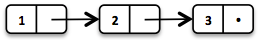

# Vavr-Playground


this is a personal-use repository, where i want to outline the need of the vavr.io framework.
In the following sections, i analyzed the user guide of vavr.io and created simple / small tests for the arguments, 
vavr uses to outline the need for the framework.


## Collections

vavr collections are **functional data structures**. We need to recover a few 
concepts to understand functional data structures in vavr.

### Immutability
An immutable class is simply a class whose instances cannot be modified. All of the information contained in each
instance is provided when it is created and is fixed for the lifetime of the object.
(Effective Java 2nd Edition)

### Persistant Data Structures
A persistent data structure does preserve the previous version of itself when being modified and is therefore 
effectively immutable. Many operations perform only small changes. Just copying the previous version wouldn’t be 
efficient. To save time and memory, it is crucial to identify similarities between two versions and share as much 
data as possible.

### Referential Transparency
An expression is called referentially transparent if it can be replaced with its corresponding value without changing
the program's behavior. This requires that the expression is pure, that is to say the expression value must be the same 
for the same inputs and its evaluation must have no side effects. An expression that is not referentially transparent 
is called referentially opaque. (wikipedia)

### Functional Data Structures 
are...
* immutable
* persistent
* methods are referentially transparent

We are now using a functional data structure (**LinkedList**) which brings us the power of all 
the functional concepts described above. Lets take a look to an instance of type List:

```
List<Integer> list1 = List.of(1, 2, 3);             // List(1,2,3)
```

The internal representation looks like this:



Lets create a second list which is based on the first one:

```
List<Integer> list2 = list1.tail().prepend(0);      // List(0,2,3)
```


what happens here is, that the internals of list1 will be reused for list2, because the 2nd and 3rd element 
of list1 and list2 are identical. This is caused by the fact, that each item of the list ist a seperate
List node consisting of the value and the pointer (tail) to the next node.


> tail() drops the first element of a non-empty Traversable.

> prepend() prepends an element to a Traversable

> Traversable is the base type of all Collections in vavr.

## Controls

### Option

In the test OptionTest you will see that the usage of Option can lead to a NPE.
In Optional, a call to map() that results in a null will result in an empty Optional. 
In Vavr, it would result in a Some(null) that can then lead to a NullPointerException.

Option forces you to pay attention to possible occurrences of null and deal with them 
accordingly instead of unknowingly accepting them.
Optional adheres to the requirement of a monad to maintain computational context.
Calling map() on a Some will result in a Some, and calling map() on a None will result in a None. 
In the Java Optional example above, that context changed from a Some to a None.
The correct way to deal with occurrences of null is to use flatMap

## Links:

[vavr-guide](http://www.vavr.io/vavr-docs/)

[vavr-javadocs](http://www.javadoc.io/doc/io.vavr/vavr/0.9.2)
